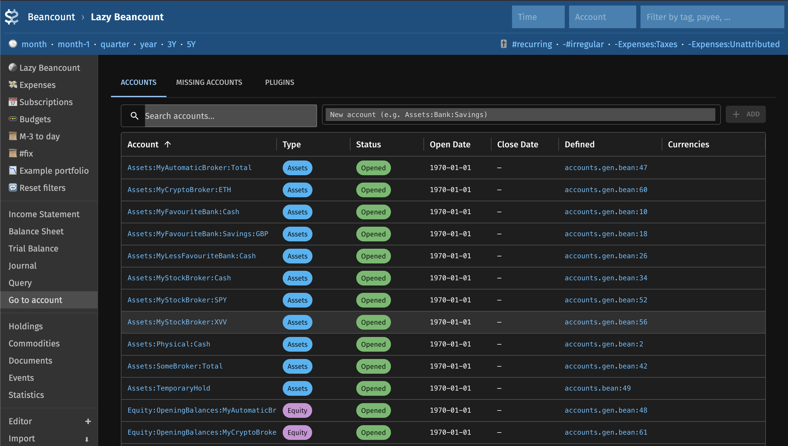

# fava-lazy-beancount

A [Fava](https://beancount.github.io/fava/) extension for [lazy-beancount](https://github.com/Evernight/lazy-beancount) workflows: inspect accounts, add missing `open` directives, and review enabled plugins.



## Features

- **Accounts**: Table of all accounts with type, status (opened, closed, auto-generated, missing), and links into Fava.
- **New accounts**: Append `open` directives to `accounts.bean` from the UI (requires that file in your ledger includes).
- **Missing accounts**: Preview and copy `open` lines for auto-inserted accounts from lazy-beancount plugins.
- **Plugins**: List Beancount plugins and Fava extensions loaded by the ledger.

Open the **Lazy Beancount** report in the Fava sidebar after enabling the extension.

## Configuration

Add the extension to your Beancount file:

```
2010-01-01 custom "fava-extension" "fava_lazy_beancount"
```

For in-app account creation, include an `accounts.bean` file from your main ledger (as in the lazy-beancount templates).

## Development

```bash
make deps    # Python + frontend dependencies
make dev     # Fava with hot reload (LEDGER_FILE=path/to/main.bean)
make lint
make format
```
